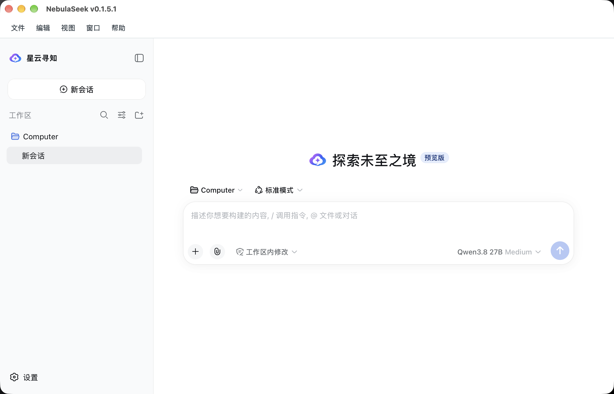
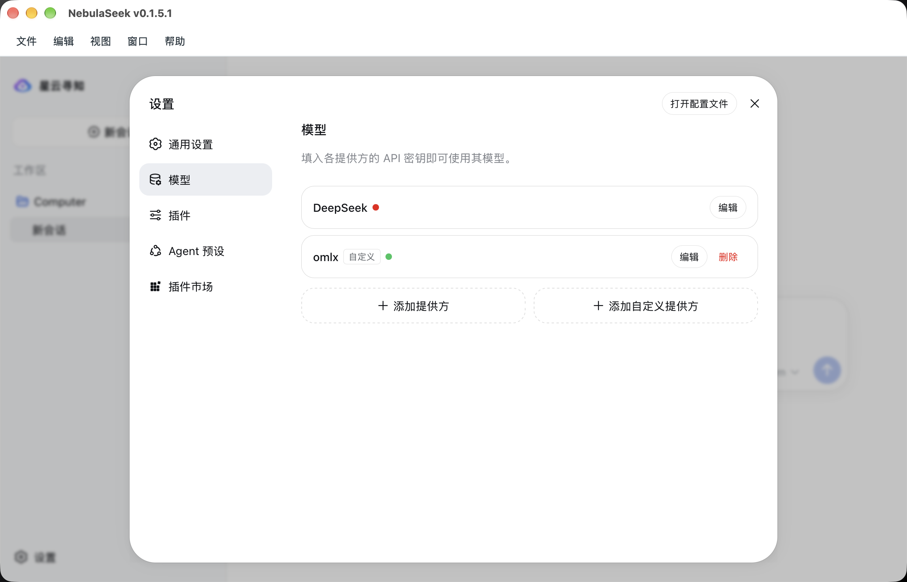

# NebulaSeek Desktop

[](https://github.com/nebulaseek/nebulaseek-desktop/actions/workflows/community-build.yml) [](https://github.com/nebulaseek/nebulaseek-desktop/releases) [](LICENSE)

NebulaSeek Desktop 是由 DeepSeek Desktop 社区版维护团队推出的客户专版，中文名称为“星云寻知”。支持 macOS、Windows 和 Linux，在一个窗口中使用模型对话、代码工具和插件，无需另行安装 Node.js、pnpm 或 Rust。

社区版面向大众用户；NebulaSeek 与其保持同一代码基线，只替换用户可见品牌和发行入口，默认内置锁定版本的 NebulaSeek Harness。本项目与 DeepSeek 不存在隶属、合作或官方背书关系。

[下载安装](#下载安装) · [开始使用](#开始使用) · [更新](#更新) · [常见问题](#常见问题) · [项目关系](#项目关系) · [开发与贡献](#开发与贡献)

## 功能与界面

- **桌面工作台**：启动即进入 Harness，支持会话、项目目录与 Agent 工具；运行状态、诊断和更新在同一窗口中打开。
- **模型接入**：使用官方 Provider 或 OpenAI Compatible 自定义服务；提供社区版已实测、经专版 Harness schema 校验的 oMLX Qwen3.8 配置示例。
- **插件与搜索**：沿用 Harness 官方插件管理机制，支持 DSH Market；联网搜索可跟随当前模型、使用网页搜索服务或关闭。
- **本地凭据**：模型密钥加密保存在本机，诊断内容经过脱敏，工作台与桌面原生权限隔离。
- **独立内核更新**：可检查 NebulaSeek Harness 更新或使用兼容 fork；候选通过构建与启动检查后才切换，失败保留当前版本。
- **多语言外壳**：支持简体中文、繁体中文和英文；Harness 工作台的语言范围由内核提供。



<details>
<summary>查看模型接入界面</summary>



</details>

界面截图用于展示主要操作，具体布局以所安装版本为准。

## 下载安装

前往 **[GitHub Releases](https://github.com/nebulaseek/nebulaseek-desktop/releases)**，选择版本正文中的下载入口。请下载安装包；GitHub 自动生成的 `Source code` 是开发源码，不能直接作为应用运行。

| 平台 | 选择的安装包 | 安装方式 |
| --- | --- | --- |
| macOS Apple 芯片 | `*_aarch64.dmg` | 打开 DMG，将应用拖入“应用程序” |
| macOS Intel | `*_x64.dmg` | 打开 DMG，将应用拖入“应用程序” |
| Windows x64 | `*_x64-setup.exe` | 运行安装向导 |
| Linux x64 | `*_amd64.AppImage` 或 `*_amd64.deb` | 为 AppImage 添加执行权限后运行，或通过系统包管理器安装 DEB |

macOS 最低版本为 13.0。各平台的构建产物与实际验证范围见 [使用指南](docs/zh-CN/getting-started.md#支持平台)及对应版本的发布说明。正常运行内置 Harness 无需开发工具链；从源码准备 Harness 更新时需要系统 Git 和相应原生编译工具。

### 校验安装包

同时下载该版本的 `SHA256SUMS`，计算安装包的 SHA-256 并与其中同名条目比较。以下命令中的文件名请替换为实际下载的文件名：

```bash
# macOS
shasum -a 256 "安装包文件名.dmg"

# Linux
sha256sum "安装包文件名.AppImage"
```

```powershell
# Windows PowerShell
Get-FileHash ".\安装包文件名.exe" -Algorithm SHA256
```

当前专版使用 GitHub 的 **Pre-release** 标记：macOS 具备 ad-hoc 完整性签名，但尚无 Apple Developer ID 签名和公证；Windows 尚无 Authenticode 签名，Linux 安装包也未提供可信发布者签名。macOS 首次打开受阻时，请查看 [“Apple 无法验证”的图文处理步骤](docs/zh-CN/getting-started.md#macos-首次打开)。

## 开始使用

1. 启动应用，等待本地 Harness 就绪并进入工作台。
2. 打开工作台的模型设置，添加 Provider，填写 API 地址与凭据并获取可用模型。
3. 在输入区选择模型；需要操作项目文件时，在工作台内添加或切换项目目录。
4. 创建会话开始使用。窗口顶部菜单可打开设置、运行状态、更新和诊断；关闭设置会返回原来的工作台。

| 需要做什么 | 查看文档 |
| --- | --- |
| 配置自定义模型、推理等级和 oMLX Qwen3.8 | [模型接入说明](docs/zh-CN/custom-provider-reasoning-effort.md) · [配置示例](docs/examples/omlx-qwen38.settings.yaml) |
| 配置跟随模型的联网搜索 | [联网搜索说明](docs/zh-CN/harness-web-search.md) |
| 安装插件市场、查看插件状态 | [模型与插件](docs/zh-CN/getting-started.md#模型与插件) |
| 找到数据目录、导出日志或卸载 | [使用指南](docs/zh-CN/getting-started.md) |

## 更新

| 更新对象 | 操作入口 | 生效方式 |
| --- | --- | --- |
| Desktop 桌面应用 | “帮助 → 检查 Desktop 更新”或 [Releases](https://github.com/nebulaseek/nebulaseek-desktop/releases) | 退出应用后手动安装新版；专版仅提醒，不自动下载安装包 |
| Harness 内核 | “设置 → 更新 → Harness 独立更新” | 准备并验证候选，下次启动切换；可固定当前版本或恢复内置 Harness |

两条更新链路相互独立。只更新 Harness 不会更新 Desktop 外壳；替换 Harness 仓库也不会替换模型配置、对话或项目数据。源码更新所需工具、失败恢复与自定义仓库说明见 [Harness 更新指南](docs/zh-CN/harness-updates.md)。

**版本规则：** 使用 `v主版本.次版本.修订版本.Desktop修订号`。前三段取自 Harness 版本，第四段从 `1` 开始，例如 Harness `v0.1.6` 对应 Desktop `v0.1.6.1`、`v0.1.6.2`。社区安装包排除 `alpha`、`beta`。内核更新频道暂按 `alpha`、`beta` 归预览版，其余（含 `rc`）归稳定版；此分类不代表官方稳定性承诺。当前基线为 Harness `0.1.5-rc.2`，对应 Desktop `0.1.5.2`。实际内核的完整版本及 commit 由 [工具链 lock](harness/toolchain-lock.json)记录，具体发行以对应 Tag 的 lock 为准。

> 当前 `v0.1.5.2` 安装包显示名称统一为 `NebulaSeek`，内核切换为真实 RC `0.1.5-rc.2`；首次使用新 Harness commit 时会通过官方 CLI 安装或更新 DSH Market，普通重启不重复安装。详见[插件安装说明](docs/zh-CN/getting-started.md#模型与插件)。

## 常见问题

### 为什么插件列表里没有插件市场？

Harness 的内置插件列表用于查看状态。DSH Market 是单独安装的社区插件，使用官方 `dsh plugin ... add` 方式接入，安装后提供自己的入口。Desktop 使用 `desktop-web` profile，不能直接把普通 Web 部署的 `--profile web` 当作桌面配置。详见[插件安装说明](docs/zh-CN/getting-started.md#模型与插件)。

### 为什么模型能对话，却无法联网搜索或输入图片？

这些能力取决于模型、API 协议和服务端。能对话不代表支持搜索；图片输入也以该模型的能力声明为准。搜索不支持时会明确提示，不会把普通模型回答当作联网结果。

### 更新或启动失败会丢失数据吗？

Harness 候选准备失败时保留当前内核，也可恢复安装包内置版本。请先导出脱敏日志并查看[故障排查](docs/zh-CN/getting-started.md#诊断与隐私)，不要通过删除应用数据目录排查启动问题。卸载应用不会自动删除项目目录或应用数据。

## 项目关系


| 版本 | 项目 | 仓库 |
| --- | --- | --- |
| 官方版 | DeepSeek Harness | [deepseek-ai/deepseek-harness](https://github.com/deepseek-ai/deepseek-harness.git) |
| 社区版 | DeepSeek Harness | [deepseek-desktop/deepseek-harness](https://github.com/deepseek-desktop/deepseek-harness.git) |
| 社区版 | DeepSeek Desktop | [deepseek-desktop/deepseek-desktop](https://github.com/deepseek-desktop/deepseek-desktop.git) |
| 星云寻知专版 | NebulaSeek Harness | [nebulaseek/nebulaseek-harness](https://github.com/nebulaseek/nebulaseek-harness.git) |
| 星云寻知专版 | NebulaSeek Desktop | [nebulaseek/nebulaseek-desktop](https://github.com/nebulaseek/nebulaseek-desktop.git) |

社区版由本团队维护，面向大众用户；NebulaSeek 是同一团队推出的客户专版。Harness 按“官方版 → 社区版 → NebulaSeek”同步，Desktop 按“社区版 → NebulaSeek”同步。

工具链 lock 记录每个 Desktop 版本实际使用的 NebulaSeek Harness commit。同步上游时只重放品牌覆盖层，避免修改社区版运行时契约。

## 开发与贡献

准备锁定版本的 Node.js `24.20.0` 与 pnpm `11.24.0`，以及当前平台的 Tauri 原生构建依赖。克隆仓库后按标准流程安装和构建：

```bash
git clone https://github.com/nebulaseek/nebulaseek-desktop.git
cd nebulaseek-desktop
corepack pnpm@11.24.0 install --frozen-lockfile
corepack pnpm@11.24.0 run build
```

`build` 会准备 Harness、构建前端与原生应用。日常开发使用 `corepack pnpm@11.24.0 tauri:dev`。架构、工具链、配置和验证命令见 [贡献指南](CONTRIBUTING.md)；完整当前平台打包与四平台 Tag 发布见 [多平台发布指南](docs/zh-CN/distributed-release.md)。

| 文档 | 内容 |
| --- | --- |
| [使用指南](docs/zh-CN/getting-started.md) | 模型、插件、数据、诊断、更新和卸载 |
| [构建配置](docs/zh-CN/build-configuration-plan.md) | 应用元数据、环境变量和 Harness 来源 |
| [发布说明规范](docs/releases/README.md) | 版本摘要、下载表格、升级说明与验证记录 |
| [更新日志](CHANGELOG.md) | 已发布历史与未发布修改 |
| [安全策略](SECURITY.md) | 信任边界与漏洞反馈 |

## 来源与许可

桌面自有源码采用 [Apache-2.0](LICENSE)。内置 Harness、Node.js 和依赖保留各自许可证，构建时生成许可证清单与 SPDX SBOM。

应用使用 NebulaSeek 云形标识；DeepSeek 模型名称及官方、社区上游归属保留真实名称。
